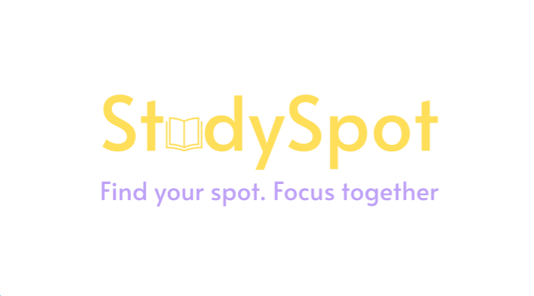
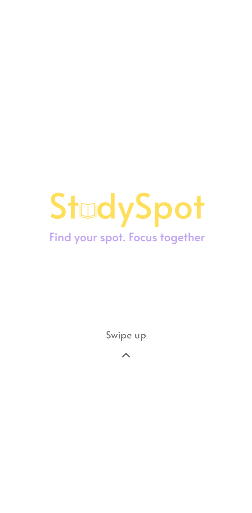
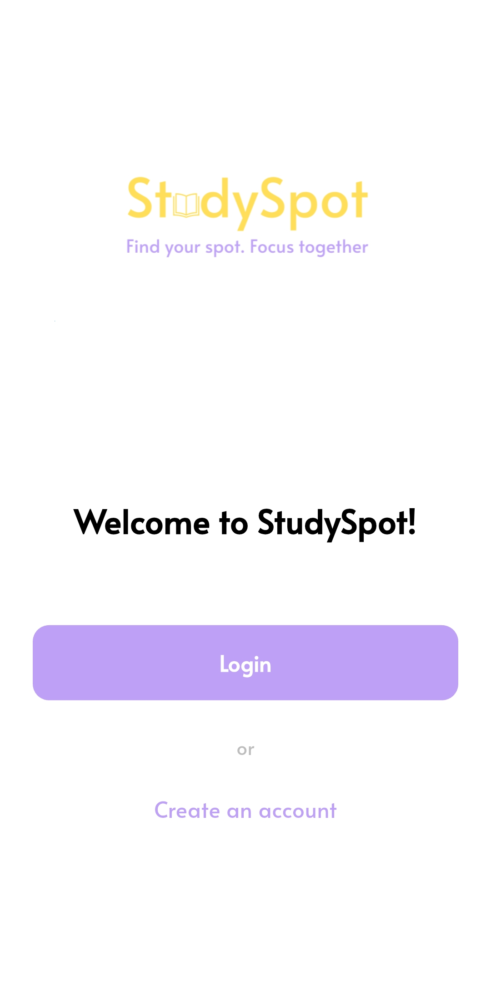
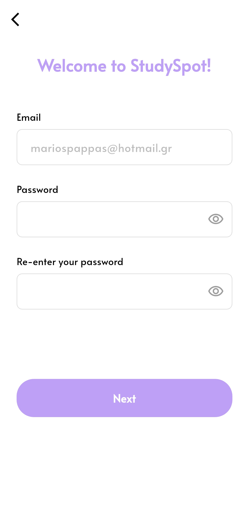
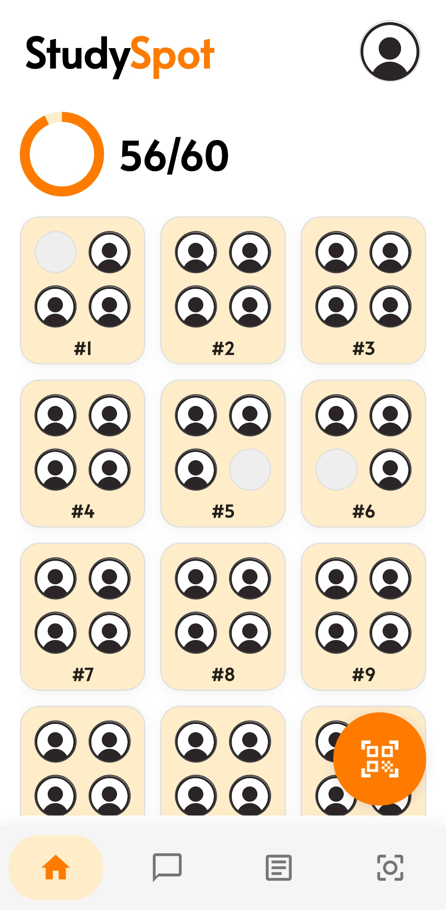
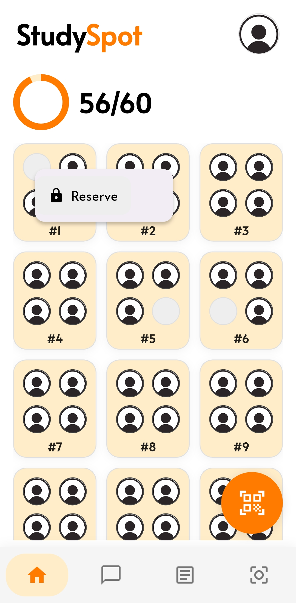
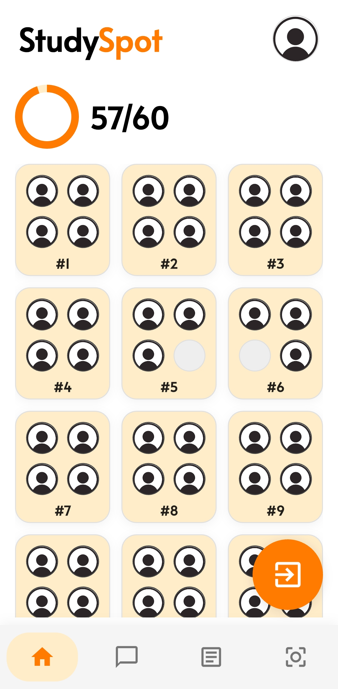
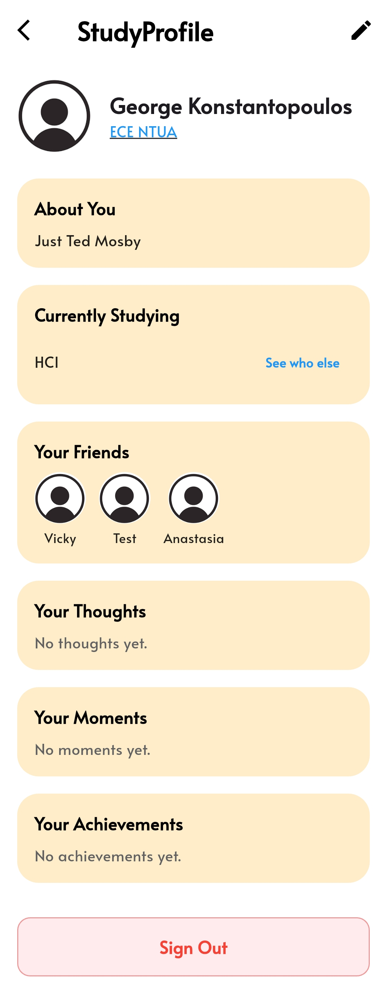
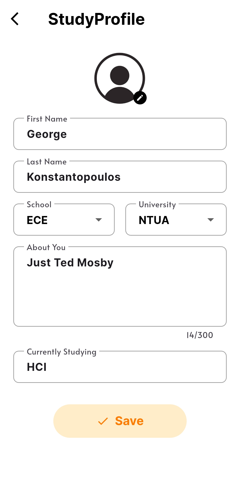
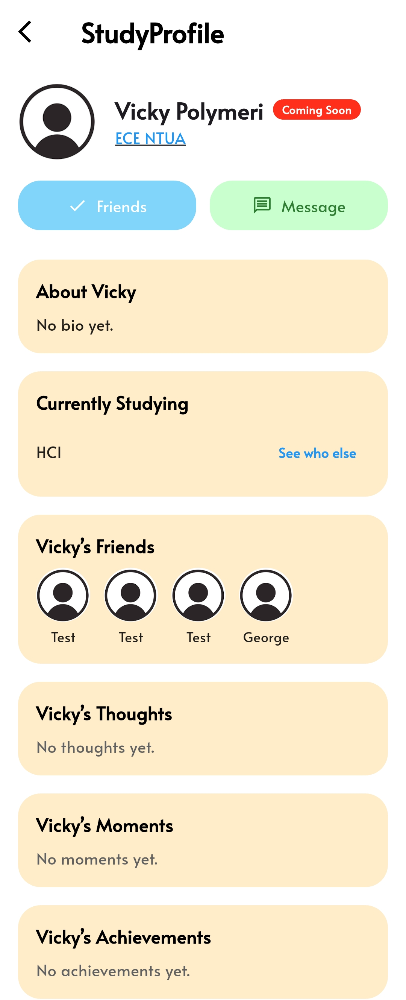

# StudySpot



**Find your spot. Focus together.**

**Το διάβασμα στο αναγνωστήριο γίνεται παιχνίδι! Κάνε τη βιβλιοθήκη τον πιο social χώρο του campus.**

- 📍 **Βρες τη θέση σου:** Δες σε πραγματικό χρόνο ποια τραπέζια είναι άδεια και ποια κατειλημμένα.
- 🔒 **Κάνε Κράτηση:** Προγραμμάτισε τη μελέτη σου κρατώντας θέση πριν φτάσεις.
- 🤝 **Συνδέσου με φίλους:** Δες ποιοι φίλοι σου διαβάζουν, τι μάθημα μελετούν, διαβάστε μαζί και ανταλλάξτε σημειώσεις.
- 🎫 **Έξυπνη Ουρά:** Δεν υπάρχει χώρος; Μπες στην digital ουρά και ενημερώσου μόλις ελευθερωθεί θέση. Ο πρώτος στην ουρά κάνει αυτόματη κράτηση της πρώτης θέσης που αδειάζει για 30 λεπτά.
- 📸 **Scan & Go:** Επιβεβαίωσε την άφιξη και την αναχώρησή σου σκανάροντας το QR code της θέσης.

---

## Πληροφορίες Ομάδας
**Μάθημα:** Αλληλεπίδραση Ανθρώπου - Υπολογιστή (2025-2026)  
**Ομάδα:** 64  
**Μέλη:**
* Κωνσταντόπουλος Γεώργιος (03122104)
* Πολυμέρη Βασιλική-Σπυριδούλα (03122641)

---

## (i) Χρήσιμα link
   - [Android APK](https://github.com/Georgekon4002/StudySpot_64/releases/download/HCI_Project64_Final/study-spot.apk)
   - [Github Repo](https://github.com/Georgekon4002/StudySpot_64)

   - [Google Drive Files](https://drive.google.com/drive/folders/1qEhCARxnHxj-DigSfqtodjFANydkKHh-?usp=drive_link)

   - [Demo Video](https://drive.google.com/file/d/1y8HMG2s00P3BvLd5Z2QhPClyz6JNuOEr/view?usp=drive_link)

   - [QR Codes](https://drive.google.com/drive/folders/1EBYBLF5RCDEIcXP_vOozZaH6MIOC0p3u?usp=drive_link)

   - [Android Studio](https://developer.android.com/studio)
   - [Flutter](https://flutter.dev)
   - [Git](https://git-scm.com)
---

## (ii) Οδηγός Εγκατάστασης

### Επιλογή 1: Εγκατάσταση σε Android συσκευή (Beginner)
1. Κατεβάστε το APK από το [Android APK](https://github.com/Georgekon4002/StudySpot_64/releases/download/HCI_Project64_Final/study-spot.apk) είτε αμέσως στη συσκευή σας είτε μεταφέρετέ το από τον υπολογιστή σας.

2. Από το My Files του κινητού σας (ή οποιοδήποτε file manager έχετε), βρείτε το **study-spot.apk** και πατήστε το για να το εγκαταστήσετε. 

*Σημείωση: Θα χρειαστεί να επιτρέψετε την εγκατάσταση από άγνωστες πηγές (π.χ. στο Samsung θα σας βγάλει ένα παράθυρο που θα σας λέει ότι είναι ενεργοποιημένο το Auto Blocker και θα χρειαστεί να το απενεργοποιήσετε από τα Setting -> Security and privacy -> Auto Blocker).*

3. Εκκίνηση της εφαρμογής από το Home Screen ή το App Drawer

### Επιλογή 2: Εκτέλεση σε Android Emulator (Intermediate)

1. Εγκατάσταση του [Android Studio](https://developer.android.com/studio)
2. Ανοίξτε το **Virtual Device Manager** στο Android Studio.
3. Δημιουργήστε από το '+' μία νέα συσκευή (π.χ. Pixel 9).

**Σημαντικό:** *Επιλέξτε system image που περιλαμβάνει τα **Google Play Services** (εικονίδιο Play Store δίπλα στο όνομα της έκδοσης).*

4. Έχοντας κατεβάσει το [Android APK](https://github.com/Georgekon4002/StudySpot_64/releases/download/HCI_Project64_Final/study-spot.apk) κάντε drag-n-drop το αρχείο στον emulator έως ότου εμφανιστεί στο App Drawer.
5. Εκκίνηση της εφαρμογής από το Home Screen ή το App Drawer

### Επιλογή 3: Εκτέλεση από τον Πηγαίο Κώδικα (Advanced)

1. Εγκαταστήστε το [Flutter SDK](https://flutter.dev/docs/get-started/install).
2. Εγκαταστήστε το [Android Studio](https://developer.android.com/studio).
3. Εγκαταστήστε το [Git](https://git-scm.com/).
4. Ανοίξτε ένα terminal (Win + R και γράψτε "cmd" και πατήστε Enter).
5. Στον επιθυμητό φάκελο εκτελέστε:
   ```bash
   git clone https://github.com/Georgekon4002/StudySpot_64.git
   cd StudySpot_64
   flutter pub get
   flutter run
   ```
6. Επιλέξτε την εκτέλεση από Chrome για την web έκδοση ή πριν εκτελέσετε τις παραπάνω εντολές, να έχετε ανοιχτό τον emulator από το Android Studio.

*Σημείωση: Βεβαιωθείτε πως στις μεταβλητές περιβάλλοντος συστήματος έχετε ορίσει ως JAVA_HOME μεταβλητή το ```C:\Program Files\Android\Android Studio\jbr``` και στο Path υπάρχει το ```%JAVA_HOME%\bin```. Για να τα επεξεργαστείτε πατήστε το Windows Key + R και γράψτε "sysdm.cpl" και πατήστε Enter. Advanced -> Environment Variables -> System Variables*

---

## (iii)Απαιτήσεις Συστήματος

- **Android SDK:**
  - `minSdkVersion`: 23 (Android 6.0)
  - `targetSdkVersion`: 34 (Android 14)
- **Dependencies:** Απαιτείται σύνδεση στο Internet για τη λειτουργία του Firebase (Real-time updates).
- **Αποθηκευτικός χώρος:** Απαιτούνται τουλάχιστον 80MB για την εκτέλεση της εφαρμογής.

---

## (iv) Οδηγίες Χρήσης

| Intro | Welcome | Create Account |
|----------------|-----------|-------|
|  |  |  |

- Δημιουργήστε λογαριασμό ή χρησιμοποιήστε έναν υπάρχοντα. Μπορούν να χρησιμοποιηθούν και τα παρακάτω:
   - email: **testX@example.com**
   - password: **password123**
   *Όπου X ένα αριθμός από το 2 έως το 6. Υπάρχει account και χωρίς το Χ*

| Home Screen | Reserve | Leave |
|-------------|---------|-------|
|  |  |  |

- Δοκιμάστε να πατήσετε μία άδεια θέση και να την κάνετε **reserve για 30 λεπτά**.
- Δοκιμάστε να σκανάρετε ένα από τα ακόλουθα [QR](https://drive.google.com/drive/folders/1EBYBLF5RCDEIcXP_vOozZaH6MIOC0p3u?usp=drive_link) όπως παράχθηκαν από το [qr.io](https://qr.io) πατώντας το Floating Button κάτω αριστερά:

| Seat 1A | Seat 2B | Seat 5D | Seat 6C | Seat 8C | Seat 13A |
|---------|---------|---------|---------|---------|---------|
|  |  |  |  |  |  |

- Αν η θέση είναι ελεύθερη θα δείτε το σχετικό μήνυμα και θα έχετε τη θέση δική σας και το status σας από **Coming Soon** θα γίνει **Seated** (μπορείτε να το δείτε στο Profile Screen πατώντας το Profile Icon). Τώρα το Floating Button είναι στη λειτουργία **Leave** για να δηλώσετε την αποχώρησή σας.

- Δοκιμάστε να **επεξεργαστείτε το προφίλ σας**, να δείτε ποιος άλλος από την σχολή σας έχει λογαριασμο και **ποιός διαβάζει το ίδιο μάθημα με εσάς** (επιλέγοντας πρώτα μάθημα στην επεξεργασία προφίλ. *Feature only available for ECE NTUA Students*)

- Δείτε άλλα προφίλ που μπορεί να βρίσκονται εντός του αναγνωστηρίου (αν είναι κάποιος φίλος σας η εφαρμογή φροντίζει να σας ειδοποιήσει) πατώντας το profile icon τους πάνω στη θέση τους. **Προσθέστε τον χρήστη αυτόν ως φίλο** ή απλώς δείτε το προφίλ του.

| My Profile | Edit Profile | Profile |
|------------|--------------|---------|
|  |  |  |

---

## (v) Διαφοροποιήσεις από την β φάση (Figma)

Η εφαρμογή υλοποιεί τον πυρήνα της εμπειρίας StudySpot:

- Παραλείψεις:
   - Οι οθόνες **StudyChat**, **StudyFeed** και **StudyFocus**
   - Ανίχνευση Τοποθεσίας **(GPS)** για αυτόματη αποχώρηση
   - **Smart Notifications** για άμεσες ειδοποιήσεις για αιτήματα φιλίας, φίλους που βρίσκονται στο αναγνωστήριο ή υπενθυμίσεις
   - **Achievements**
   - 

- Προσθέσεις:
   - **Αρίθμηση θέσεων και τραπεζιών** για ευκολότερη εύρεσή τους από τον χρήστη στον πραγματικό κόσμο
   - Δυνατότητα του χρήστη να **βλέπει ποιες θέσεις είναι reserved και για πόση ώρα ακόμα**
   - Αλλαγή του **Floating Button** που δεν εμφανίζει ένα pop-up menu γιατί κάθε φορά μία εκ των δύο λειτουργιών είναι ενεργή (είτε το Scan QR είτε το Leave). Οπότε απλώς το κουμπί **αλλάζει δυναμικά την ενέργεια που εκτελεί** ανάλογα με τις συνθήκες που επικρατούν (αν ο χρήστης έχει κάνει κατάληψη κάποιας θέσης τότε το Floating Button είναι στη λειτουργία **Leave** αν όχι είναι στην λειτουργία **Scan QR**). Είναι πιο απλό και λιγότερο χρονοβόρο.
   - **Δεν απαιτείται σκανάρισμα του QR της ουράς για να μπει κάποιος στην ουρά**, ώστε να μπορεί να μπει και χωρίς την παρουσία του στο αναγνωστήριο, ώστε όποτε φτάσει η σειρά του να πάει εγκαίρως στο αναγνωστήριο και να μην χάσει χρόνο περιμένοντας. Για αυτό το 'Scan to Enqueue' αντικαταστάθηκε από το απλό **'Enqueue'**.
   - Στο προφίλ μπορεί κανείς να δει το **Status** κάποιου άλλου χρήστη (αν είναι στο αναγνωστήριο έχει το status **Seated** με πορτοκαλί χρώμα, ενώ εάν έχει κάνει κράτηση κάποια θέση έχει το κόκκινο status **Coming Soon**).
   - Από το προφίλ μπορεί πλέον ο χρήστης πατώντας πάνω στη σχολή του εκάστοτε χρήστη να βρει και **άλλους χρήστες της αντίστοιχης σχολής**, αλλά και μέσω του κουμπιού 'See who else' να βρει τους **χρήστες που διαβάζουν το ίδιο μάθημα**.
   - Προστέθηκε η δυνατότητα **'Sign Out'**.

## (vi) Demo Video

Δημιουργήσαμε και ένα μικρής διάρκειας βίντεο - tutorial για το πως λειτουργεί η εφαρμογή που βρίσκεται στον παρακάτω σύνδεσμο:

[Demo Video](https://drive.google.com/file/d/1y8HMG2s00P3BvLd5Z2QhPClyz6JNuOEr/view?usp=drive_link)